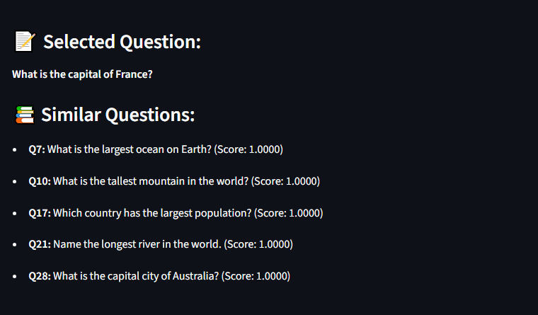
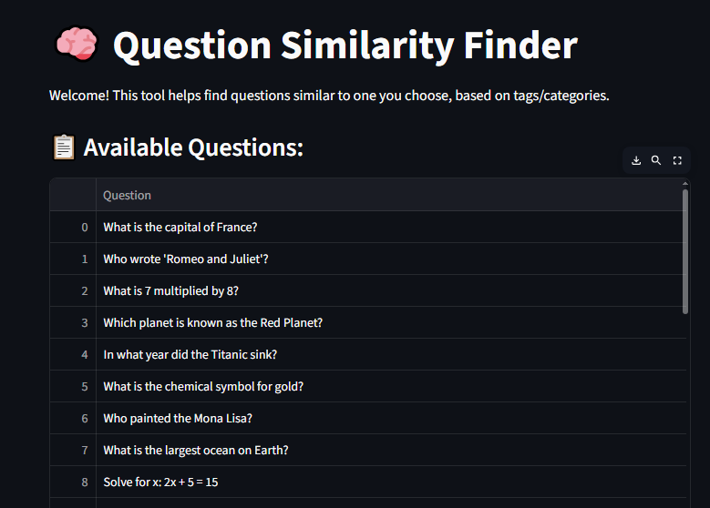

# 🧠 Question Similarity Finder

Welcome to the **Question Similarity Finder**, a simple yet powerful web app built in Python using **Streamlit** and **scikit-learn**. This tool allows you to explore and discover similar questions based on their tags or categories using a content-based recommendation system.

## ✨ Features

- ✅ Select any question by ID
- ✅ Get top 5 most similar questions based on tags
- ✅ Interactive and easy-to-use web interface
- ✅ Uses cosine similarity with bag-of-words (CountVectorizer)
- ✅ Built with Python, Pandas, scikit-learn, and Streamlit

## 📷 Screenshots

| Choose Question  | See Similar Questions |
|------------------|-----------------------|
|  

```
project/
├── data.csv                # Main dataset (Questions + Categories)
├── app.py                  # Main Streamlit app
├── README.md               # This readme file
├── requirements.txt        # Required packages
└── screenshots/            # Optional folder for UI screenshots
```

## 📦 Requirements

Make sure you have Python 3.7+ installed.

Install required libraries:
```bash
pip install -r requirements.txt
```

**requirements.txt**
```
pandas
scikit-learn
streamlit
```

## ▶️ Running the App

To start the web app, use:

```bash
streamlit run app.py
```

Once it starts, it will open in your default browser at:
```
http://localhost:8501/
```

## 📊 About Your Data (`data.csv`)

The app expects a CSV file named `data.csv` with these two columns:

| Column Name | Description                        |
|-------------|------------------------------------|
| Question    | The question text/title            |
| Category    | Tags or keywords related to the question (separated by space) |

### Example:

```csv
Question,Category
"What is Python?",python basics
"Difference between SQL and NoSQL?",database sql
"DBMS normalization levels",dbms normalization
...
```

## 🔧 How It Works

1. **Text Vectorization:** Tags from the `Category` field are converted to vectors using `CountVectorizer`
2. **Similarity Calculation:** Cosine similarity is calculated between question vectors
3. **Recommendation:** The top 5 most similar questions (with non-zero scores) are displayed

## 🙋‍♂️ Author

💡 Built by a 3rd-year student exploring Python, ML, and practical web development projects ❤️

## 🛠️ Future Ideas

- Use question **text or title** instead of just tags
- Add search/filter functionality
- Add user login/logout or personalized history
- Connect to a live database or backend API
- Add a download/print feature for results